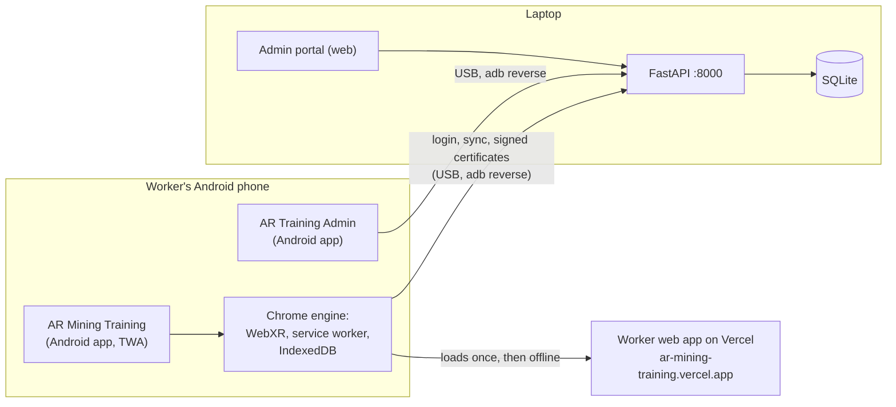

# AR Mining Training App

AR safety training for Jharkhand's mining, steel and mica workers (SIH 2026, PS SIH26041).
Workers train on their own Android phone, with no headset: the training scene is placed on the
floor in AR (or shown in 3D on phones without AR), every step is scored, and passing earns a
signed certificate whose QR code anyone can verify, even offline. Supervisors follow compliance
in a web/Android admin portal.

| What                 | Where                                                                                                                         |
| -------------------- | ----------------------------------------------------------------------------------------------------------------------------- |
| Worker app (Android) | `apps/android/dist/ar-mining-training.apk` (built by `npm run android`)                                                       |
| Admin app (Android)  | `apps/android/dist/ar-training-admin.apk` (built by `npm run android:admin`)                                                  |
| API                  | On the laptop: `npm run dev:api`; the phone reaches it over USB (`adb reverse`). Optional cloud hosting: `npm run deploy:api` |
| Scope and phase plan | [PROJECT_BRIEF.md](PROJECT_BRIEF.md)                                                                                          |
| Demo logins          | Worker `11010` PIN `1234` (not yet certified; any of the 48 demo workers, see [Demo data](#demo-data))                        |

> **Status:** Phases 0–5 and 7 are done. Phase 6 (the bonus Machinery/LOTO and Card Scan
> modules) is not built yet.

**Contents:** [Problem statement coverage](#problem-statement-coverage) ·
[Training modules](#training-modules) · [How it fits together](#how-it-fits-together) ·
[Setup](#setup) · [Development](#development) · [Deploy and install](#deploy-and-install) ·
[Demo script](#demo-script) · [Certificates](#certificates-and-verification) ·
[Admin portal](#admin-portal) · [Languages](#languages) · [Offline](#offline) ·
[Performance](#performance) · [Scripts](#scripts) · [Troubleshooting](#troubleshooting)

## Problem statement coverage

| Requirement                                    | How                                                                                                                                                                                                  |
| ---------------------------------------------- | ---------------------------------------------------------------------------------------------------------------------------------------------------------------------------------------------------- |
| Mobile AR on mid-range Android 10+, no headset | WebXR `immersive-ar` in Chrome (hit-test placement, DOM overlay, crouch tracking), packaged as an Android app (Trusted Web Activity). Phones without AR get the same scene in 3D, same steps/scores. |
| Two complete interactive AR modules            | Fire & Explosion Response, Gas Leak & Confined Space (plus an AR Basics practice module)                                                                                                             |
| Assessment that verifies comprehension         | 60% practical (actions, order, time) + 40% scenario quiz; pass mark 70%; critical errors fail the attempt with an explanation; retraining of missed steps; per-step mastery; 1/3/7-day refreshers    |
| QR certificate generation and verification     | SHA-256 + Ed25519 signed certificates; QR links verify offline in the app and the portal; revocation checked online                                                                                  |
| Hindi and Santali                              | Full English and Hindi; Santali (Ol Chiki) drafts flagged for native review, Hindi fallback, translator CSV export/import                                                                            |
| Offline                                        | Installable app with everything precached; training, scoring and provisional certificates work in airplane mode; results sync later                                                                  |
| Web admin compliance dashboard                 | KPIs, sites map, module results, insights, workers, certificates, verification, reports (PDF/CSV), settings; on the web and as an Android app                                                        |
| Blockchain (later)                             | `ChainAnchor` adapter: stub by default, Polygon Amoy anchoring when a test wallet key is set                                                                                                         |

## Training modules

| Module                    | Kind     | What the worker does                                                                                                                                                                                                                                                             |
| ------------------------- | -------- | -------------------------------------------------------------------------------------------------------------------------------------------------------------------------------------------------------------------------------------------------------------------------------- |
| AR Basics                 | Practice | Place and turn the area, tap, drag, aim, press-and-hold, crouch                                                                                                                                                                                                                  |
| Fire & Explosion Response | Assessed | Raise the alarm, identify an electrical fire, pick the extinguisher, PASS (pull, aim, squeeze, sweep), stay low under smoke, evacuate past a blocked exit, stay out                                                                                                              |
| Gas Leak & Confined Space | Assessed | Mark the hazard zones and the manhole where LPG collects, stop a spark, get out upwind (windsock), call it in; then test the pit (O₂ → LEL → H₂S/CO), ventilate, re-test and sign the permit, dress the entrant, post an attendant, radio check, non-entry rescue with the winch |

**Assessment:** 60% practical (correct actions, order, time) + 40% scenario quiz (5 illustrated,
narrated questions). Pass mark 70%. Any critical error fails the attempt, with an explanation:
water on an electrical fire, a blocked exit or the lift, going back inside (Fire); operating a
switch in the gas, entry with no attendant outside, going in to rescue without breathing
apparatus (Gas). After a failure the worker can practise only the steps they missed; after a
pass, refresher drills are scheduled for 1, 3 and 7 days and offered on the home screen. All
safety text lives in `packages/shared/content/modules/*.json` with source notes for expert
review.

## How it fits together



- The **worker app** is a React + three.js web app. The Android app is a Trusted Web Activity
  (Bubblewrap): a small signed APK that opens the deployed web app full screen in Chrome's
  engine, because WebXR AR only runs in Chrome (an Android WebView cannot do AR). Chrome hides
  its address bar because the site's `/.well-known/assetlinks.json` names the APK's signing key.
- The **admin app** is the portal packaged with Capacitor in a native WebView (no browser).
- The **API** (FastAPI) runs on the laptop with SQLite. The phone reaches it as
  `http://localhost:8000` through the USB cable (`adb reverse`), which it needs only for the first
  login on a phone and for syncing; training works without it. The same code is ready to run in
  the cloud on Postgres (see [Optional: hosted API](#optional-hosted-api)), which removes the
  cable.

| Path                      | What                                                                     |
| ------------------------- | ------------------------------------------------------------------------ |
| `apps/mobile`             | Worker app: React 18 + TS + Vite, React Three Fiber, `@react-three/xr`   |
| `apps/mobile/src/engine`  | AR engine: placement, input, aiming, crouch tracking, 3D fallback, HUD   |
| `apps/mobile/src/modules` | Module scenes (3D content + step logic), one folder per module           |
| `apps/admin`              | Admin portal: React + Vite + Tailwind (shadcn/ui), Recharts, Leaflet     |
| `apps/admin/android`      | Admin Android app (Capacitor): the portal packaged in a native WebView   |
| `apps/android`            | Worker Android app (TWA) config; `npm run android` generates and builds  |
| `services/api`            | FastAPI service (Python, `.venv` inside); `vercel/` = hosted entry point |
| `packages/shared`         | Shared TypeScript types, content schemas, scoring, certificates          |
| `packages/shared/content` | Module content JSON (reviewable; every module has `review.source/notes`) |
| `scripts`                 | Dev, deploy and Android build helpers, translation export/import         |

## Setup

Prerequisites:

- Node.js 20.19+ (24 recommended) and npm; Python 3.11+
- For the phone: Android SDK Platform-Tools (`adb`) and, to build APKs, Android Studio (its
  bundled JDK and SDK are found automatically). The scripts also look in the default Android
  Studio SDK folder, so nothing has to be on `PATH`.
- Android 10+ phone with Chrome and Google Play Services for AR, USB debugging enabled
- To deploy the web app: a Vercel account (`npx vercel login`)

```sh
npm install
npm run setup:api      # services/api/.venv with the API's dependencies
```

### Demo data

On first start the API creates `services/api/dev.db` (locally) and seeds: 4 sites (Dhanbad,
Bokaro, Ranchi, Koderma), 48 workers and a year of generated training history (marked as demo
data). **Worker logins: any ID from `11001`–`11012`, `12001`–`12012`, `13001`–`13012`,
`14001`–`14012`, PIN `1234`.** Portal admin: `admin@test.com` / `admin1234` (change with
`ARMT_ADMIN_EMAIL` / `ARMT_ADMIN_PASSWORD` before the first start, or add admins under Settings).

Start from an empty history with `ARMT_SEED_HISTORY=0`, or reset everything with
`python -m app.seed --reset` (from `services/api`, inside its virtualenv).

## Development

Run each in its own terminal:

```sh
npm run dev        # worker app on http://127.0.0.1:5173 (hot reload)
npm run dev:api    # API on http://127.0.0.1:8000 (SQLite)
npm run phone      # adb reverse 5173 + 8000, then opens http://localhost:5173 in Chrome on the phone
npm run dev:admin  # admin portal on http://localhost:5174
```

`localhost` on the phone is tunnelled to the laptop by `adb reverse`, which makes it a secure
context (WebXR requires one) and keeps hot reload working. Re-run `npm run phone` after
reconnecting the cable.

- **Phone console logs:** open `chrome://inspect/#devices` in Chrome on the laptop and click
  **inspect** under `localhost:5173` (this also works for the installed Android app).
- **Force the 3D fallback** on an AR-capable phone: open `http://localhost:5173/?mode=3d`.
- **Performance:** add `?debug` to log fps, draw calls and triangles every 2 s.
- **Production build locally:** `npm run app` (serves on :4173, with the service worker) and
  `npm run phone:app`.
- Checks: `npm test` (mobile, shared, admin, API), `npm run typecheck`, `npm run lint`,
  `npm run format:check`. API tests run on SQLite; set `ARMT_TEST_DATABASE_URL` to an empty
  Postgres database to run them on Postgres.

## Deploy and install

Keep `npm run dev:api` running on the laptop and the phone connected by USB. While it runs it
keeps every connected phone's `localhost:8000` tunnelled to it (`adb reverse`), and restores
the tunnel within seconds when the cable is moved or replugged.

### Worker Android app

```sh
npm run android
```

Builds the web app → deploys it to Vercel (production, https://ar-mining-training.vercel.app) →
generates the Android project with Bubblewrap from `apps/android/twa-manifest.json` → builds and
signs the APK → installs it on the USB-connected phone (on Xiaomi phones, tap **Install** on the
"Install via USB" prompt) → sets up `adb reverse` for the API → launches it. "AR Mining Training"
then opens from the app drawer, full screen, with no browser bar.

- `npm run android -- --no-deploy` rebuilds and reinstalls the APK only;
  `-- --no-install` only builds `apps/android/dist/ar-mining-training.apk`.
- The app loads the live site, so web updates reach installed phones on the next launch
  without reinstalling (the home screen offers **Update**).
- Signing key: created on first run in `apps/android/keys/` (gitignored). **Back it up**: updates
  must be signed with the same key, and a new key means changing `assetlinks.json` and
  reinstalling. Both Android apps use it.
- Long-press the app icon for **Verify a certificate** and **My certificates** shortcuts.
- Screen: the app is portrait; each module sets its orientation in
  `apps/mobile/src/modules/registry.ts` (AR Basics rotates freely).
- **The laptop link:** the app calls the API at `http://localhost:8000`, which `adb reverse`
  forwards to the laptop. It is needed for the first login of a worker on a phone, for syncing
  results and for signing certificates; training, scoring and provisional certificates work
  without it. If Chrome asks to allow
  access to devices on the local network, tap **Allow**.

### Admin Android app

```sh
npm run android:admin
```

Builds the portal, packages it with Capacitor (the portal runs inside the APK, in a native
WebView), signs it and installs "AR Training Admin" on the phone. It talks to the same laptop API
through `adb reverse`; the server address can be changed on its login screen or under Settings.
Sign in with `admin@test.com` / `admin1234`.

### Installing the APKs on other phones

Copy `apps/android/dist/ar-mining-training.apk` (and optionally `ar-training-admin.apk`) to the
phone (WhatsApp, Drive, USB), open it in the Files app and allow "Install unknown apps" for that
app when Android asks. The worker app needs Chrome and, for AR, Google Play Services for AR
(installed from the Play Store when Chrome first asks). The first launch needs internet, and the
first login needs the API (laptop over USB, or a hosted API).

### Optional: hosted API

To run without the laptop and cable, the API can be hosted on Vercel with a free Neon Postgres
database. Everything is prepared; it has not been deployed yet.

1. Run `npm run deploy:api`. It bundles `services/api` with the module content and creates the
   Vercel project `ar-mining-training-api` (functions in Singapore, `sin1`).
2. The first time it stops at the database: Neon needs a person to accept its terms. In the
   Vercel dashboard open the project → **Storage** → **Create Database** → **Neon** → accept →
   Region **Singapore**, Plan **Free** → Create → connect it to the project (all environments).
3. Run `npm run deploy:api` again. It sets the secrets, seeds the demo data, deploys and checks
   the result (health, worker login, CORS, certificate key, admin login), then writes the address
   to `services/api/vercel/deployment.json` (commit it).
4. `npm run android` and `npm run android:admin` then build against the hosted API, and no
   cable is needed.

Secrets are kept in `services/api/keys/hosted.json` (gitignored): the JWT secret and the hosted
portal admin password (`admin@test.com` / a generated password, printed at the end).
Certificates are signed with the same key as the laptop API
(`services/api/keys/cert_signing_ed25519.key`), whose public half is built into the app.
**Back up `services/api/keys/`.**

## Demo script

About 10 minutes, with "AR Mining Training" installed and the phone connected to the laptop
running `npm run dev:api` (after step 1 the cable is only needed for syncing).

1. **Language and login.** Open **AR Mining Training**. Choose **हिन्दी** (the whole app, the
   modules and the voice narration switch to Hindi; ᱥᱟᱱᱛᱟᱲᱤ shows the Santali review notice).
   Log in with worker ID `11010`, PIN `1234` on the number pad (a new worker with no
   certificates yet; `12010`, `13010` and `14010` are the same at the other sites).
2. **Home.** Role and site are shown in the chosen language. Modules show progress and
   certificate status; the sync chip shows whether results are uploaded.
3. **AR Basics (practice).** Tap **Start** → the device check confirms AR → point the camera at
   the floor, tap to place the training area, then follow the narrated steps (turn, tap, drag,
   aim with the crosshair, press-and-hold, crouch).
4. **Fire & Explosion Response (assessed).** Raise the alarm at the call point; identify the
   fire as electrical; pick the **CO₂** extinguisher (picking water is a critical error, try it
   on a second run to show the explanation); PASS: tap to pull the pin, aim at the base of the
   fire with the crosshair, press and hold to squeeze, sweep left-right; when smoke rises,
   physically **crouch** with the phone and move to the exit; the first exit gets blocked, take
   the other one to the assembly point; answer the 5-question quiz.
5. **Result and certificate.** The result shows practical/quiz scores and a per-step
   breakdown. On a pass, open the certificate: it shows a QR code and is signed by the API
   within seconds of syncing (provisional until then).
6. **Verify.** Scan the certificate's QR code with any phone's camera: it opens the verify screen
   and checks the signature offline. Or use the long-press shortcut **Verify a certificate**, or
   the portal's **Verify Certificate** page (camera, image or ID such as `CERT-0017`).
7. **Admin portal.** Open **AR Training Admin** (or `npm run dev:admin` on the laptop): the
   attempt from step 4 appears in Dashboard → Recent assessments and in the worker's page with
   per-step mastery. Revoke the certificate under Certificates, then verify it again on the
   phone: it shows **Revoked**.
8. **Offline.** Turn on airplane mode, run AR Basics or a module again: training, scoring and a
   provisional certificate all work. Turn the network back on (with the cable connected): the
   sync chip uploads the result and the certificate gets its `CERT-…` id and signature.
9. **Gas Leak & Confined Space** follows the same pattern: hazard zones, no switches, upwind
   escape, O₂ → LEL → toxic gas testing, ventilation and permit, PPE on the avatar, attendant,
   radio check and non-entry rescue.

## Certificates and verification

- **Issued offline, signed online.** Passing an assessment gives the worker a _provisional_
  certificate on the phone straight away (id `P-XXXXXXXX`). When the phone syncs, the API
  re-checks the result with the pass mark in force, assigns `CERT-0001`-style ids and signs it.
- **Tamper-proof.** The certificate details are hashed (SHA-256 over canonical JSON) and the hash
  is signed with the API's **Ed25519** key. A certificate stays valid for 1 year (portal
  setting).
- **QR code = link + proof.** The QR on a certificate encodes
  `https://ar-mining-training.vercel.app/#c=…` with the details, hash, key id and signature.
  Scanning it with any phone camera opens the worker app's verify screen (or the installed
  app); the app and the admin portal check the signature **offline** with the public key, then
  confirm revocation with the server when online. Typing an ID (`CERT-0017`) checks it online.
- **Sync engine.** Results and step events are queued in IndexedDB and uploaded whenever the
  phone is online (on start, after each attempt, when the network returns, every few minutes),
  with exponential backoff. The home screen chip shows _Synced_ / _N results to upload_ and
  syncs on tap.
- **Blockchain (optional).** Certificate hashes can be anchored on **Polygon Amoy** (testnet):
  set `ARMT_POLYGON_PRIVATE_KEY` on the API to a test wallet funded from the Amoy faucet and
  restart it; the Blockchain Log page then anchors certificates and links each transaction on
  PolygonScan. Without a key the stub adapter reports "not anchored yet" (nothing is faked).

## Admin portal

Pages: Dashboard (KPIs, sites map, module results, insights, recent assessments, verify, common
mistakes, critical errors, 3D module preview), Workers (filters, add/edit, PIN reset, history,
per-step mastery, certificates), Modules (pass rates, hardest steps, quiz accuracy, trend),
Assessments (every attempt with step breakdown), Certificates (revoke, PDF with QR), Verify
Certificate (ID, QR camera scan or image, offline signature check), Blockchain Log, Reports (PDF
and CSV compliance exports by period, sector and site) and Settings (pass mark, certificate
validity, sites, admins, phones). English and हिन्दी. Exports in the Android app open the share
sheet (save to Files, Drive, WhatsApp…).

Sign in with `admin@test.com` / `admin1234` (on a hosted API: the password from
`services/api/keys/hosted.json`).

## Languages

English, हिन्दी and ᱥᱟᱱᱛᱟᱲᱤ (Santali, Ol Chiki). Fonts for all three scripts are bundled, and
every instruction is narrated (Web Speech API, or recorded audio when present).

- **Hindi** covers the whole app and all module content, including worker roles, sites and
  districts that come from the server.
- **Santali strings are never invented.** The few machine-drafted ones are marked
  `needsReview: true` (tests enforce this); everything else falls back to Hindi until a native
  speaker translates it, and the app shows a notice while Santali is selected.
- **Translator workflow:** `npm run i18n:export` writes every UI and module string (en / hi /
  sat + review flags and safety notes) to `translations/strings.csv`. The translator fills the
  `sat` column (and may correct `hi`); a native-speaker reviewer sets `satNeedsReview` to
  `false` for checked strings. `npm run i18n:import` reads it back, rejecting rows whose
  `{{placeholders}}` differ from English or whose Santali has no Ol Chiki letters
  (`-- --dry-run` to preview).
- **Recorded narration** can replace text-to-speech: see
  [apps/mobile/src/assets/audio/README.md](apps/mobile/src/assets/audio/README.md).

## Offline

After the first launch the app shell, all code (including the 3D engine and scenes), fonts,
narration audio and module content are precached by the service worker. Workers who have logged
in on a phone can log in again offline with their PIN; training, scoring, certificates
(provisional) and verification work in airplane mode, and results upload when the network
returns.

## Performance

Budgets from the brief: 60 fps on mid-range phones, < 60k triangles per scene, pixel ratio
capped at 1.5, no real-time shadows, procedural low-poly models (no downloaded assets).

| Measure                            | Value                                                                 |
| ---------------------------------- | --------------------------------------------------------------------- |
| JavaScript before the first screen | ~590 kB (190 kB gzipped); the 3D engine (1.1 MB) loads right after it |
| Triangles / draw calls             | AR Basics 700 / 26 · Fire 3.5k / 135 · Gas 6.1k / 127                 |

## Scripts

| Script                  | Does                                                           |
| ----------------------- | -------------------------------------------------------------- |
| `npm run dev`           | Worker app dev server (hot reload, no service worker)          |
| `npm run dev:api`       | API on :8000 (SQLite, auto-reload); keeps the phone tunnelled  |
| `npm run setup:api`     | Create `services/api/.venv` and install the API's dependencies |
| `npm run phone`         | Check adb/device, reverse ports, open the dev app on the phone |
| `npm run phone:reverse` | Same, without opening Chrome                                   |
| `npm run app`           | Build and serve the installable worker app on :4173            |
| `npm run phone:app`     | Point the phone at the installable app                         |
| `npm run deploy:api`    | Optional: host the API on Vercel with Neon Postgres            |
| `npm run android`       | Deploy the worker app, build the signed APK, install it        |
| `npm run android:admin` | Build and install the admin Android app (Capacitor)            |
| `npm run dev:admin`     | Admin portal dev server on :5174                               |
| `npm run admin:app`     | Build the admin portal and serve it on :4174                   |
| `npm run i18n:export`   | Export all strings to `translations/strings.csv`               |
| `npm run i18n:import`   | Import translated strings from the CSV                         |
| `npm test`              | Unit tests (mobile, shared, admin) and API tests (pytest)      |
| `npm run typecheck`     | Strict TypeScript across workspaces                            |
| `npm run lint`          | ESLint                                                         |
| `npm run format`        | Prettier                                                       |
| `npm run build`         | Typecheck and production build of all workspaces               |

## Troubleshooting

| Problem                                                      | Fix                                                                                                                                                                                |
| ------------------------------------------------------------ | ---------------------------------------------------------------------------------------------------------------------------------------------------------------------------------- |
| `adb` not found or no device                                 | The phone scripts print step-by-step fixes (cable in File transfer mode, USB debugging, accept the prompt, `adb kill-server`).                                                     |
| Install fails with `INSTALL_FAILED_USER_RESTRICTED` (Xiaomi) | Unlock the phone and tap **Install** on the "Install via USB" prompt (Developer options → "Install via USB" must be on).                                                           |
| The Android app shows Chrome's address bar                   | `https://ar-mining-training.vercel.app/.well-known/assetlinks.json` must match the signing key: re-run `npm run android`. Vercel Deployment Protection must be off for production. |
| "AR not available" on an AR phone                            | Install/update **Google Play Services for AR** from the Play Store and update Chrome; allow the camera when asked.                                                                 |
| Login says it cannot reach the server                        | Start `npm run dev:api` on the laptop with the phone connected by USB (it sets up `adb reverse` itself). Workers who logged in before can log in offline.                          |
| Chrome asks about devices on the local network               | Tap **Allow**: that is the app reaching the laptop API through the cable.                                                                                                          |
| `npm run deploy:api` stops at the database                   | Create the Neon database once in the Vercel dashboard (see [Optional: hosted API](#optional-hosted-api)), then run it again.                                                       |
| Gradle build runs out of memory                              | Stop the dev servers and the emulator while building the APKs.                                                                                                                     |
